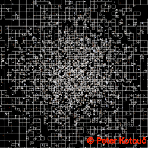
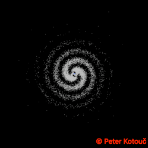
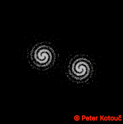
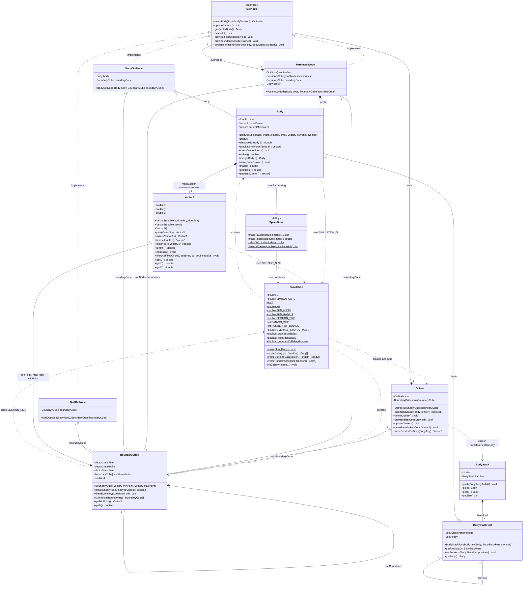
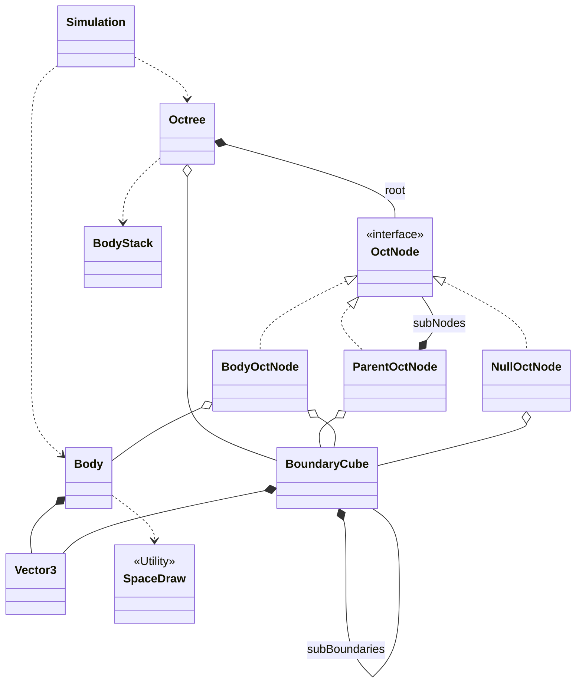
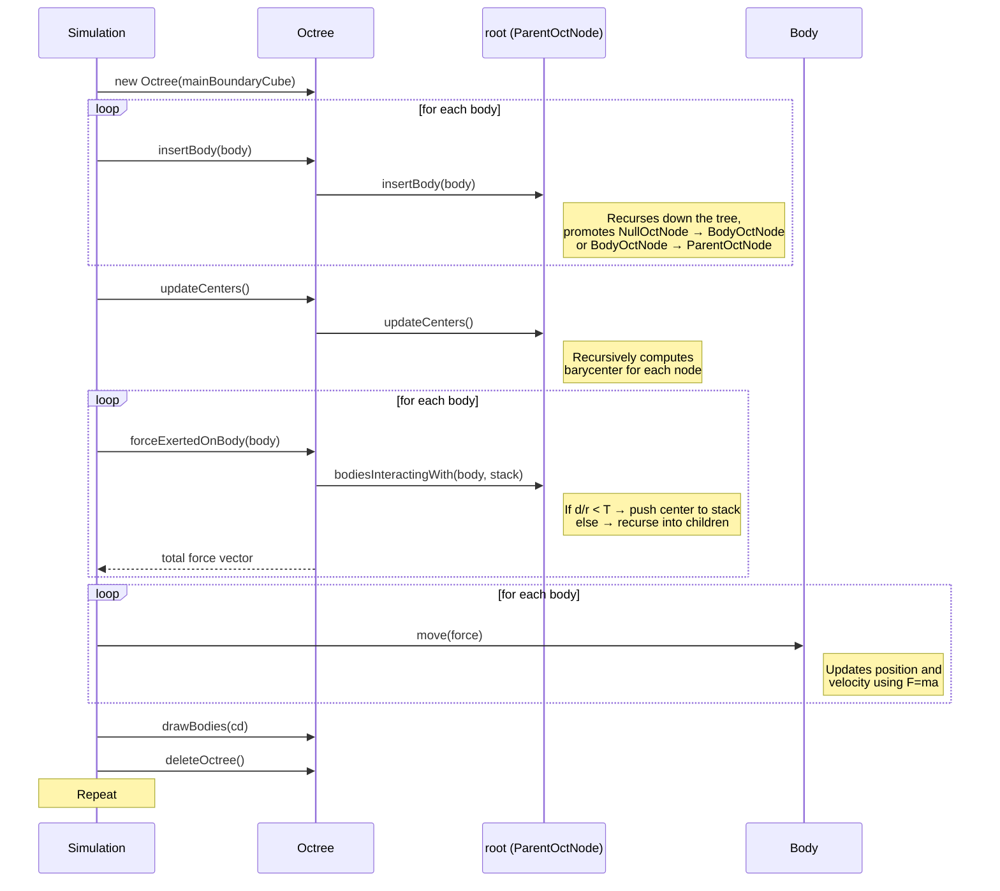

# Barnes-Hut 3D N-Body Simulation

## Preview

|        5,000 Bodies (With Boundaries)        |           10,000 Bodies (No Boundaries)           |
| :------------------------------------------: | :-----------------------------------------------: |
|          |          |
|      **Single Galaxy (10,000 Bodies)**       |      **Colliding Galaxies (20,000 Bodies)**       |
|  |  |

An efficient, fully functional 3D N-Body simulation written in Java, utilizing the **Barnes-Hut algorithm** and an
internally implemented **Octree** data structure to accelerate gravitational force calculations.

> This project was originally created in 2022 as part of the **Introduction to Programming 2** course at TU Wien, since
> then this project was improved by adding more formal pre- and postconditions in the comments and improving the overall
> code structure. I have also added simulation of galaxies.
>
> Later I became a tutor for the same course and other courses at TU Wien to help guide other students.
> Special thanks to professor Franz Puntigam for his expertise and allowing me to work at the university for this course.

## Features

- **Efficient N-Body Simulation:** By utilizing the Barnes-Hut algorithm with an Octree, the computational complexity is
  reduced from $O(N^2)$ to $O(N*\log N)$, enabling the real-time simulation of thousands of bodies (currently configured
  for `10 000` bodies).
- **Realistic Physical Context:** The simulation relies on real astronomical constants (Gravitational Constant $G$,
  Astronomical Units $AU$, Solar Mass, and Solar Radius) to perform calculations in a 3D space.
- **Star Color Rendering:** Calculates star colors based on mass-temperature relationships (automatically approximating
  Kelvin body temperature and mapping it to RGB color limits). For this, I used Tanner Helland's algorithm as described in SpaceDraw.java.
- **Visualized with CodeDraw:** Employs the fast and lightweight `CodeDraw` Java graphics library for plotting bodies
  frame by frame without lag. Developed by Niklas Kraßnig and extensively used by students at TU Wien for introductory
  programming courses.
- **Object-Oriented Design:** Built with a strong focus on correct OOP methodology. The octree structure leverages
  custom subtype relationships and polymorphism for the different types of tree nodes (such as internal nodes, leaf
  nodes containing bodies, and empty nodes), keeping the recursive tree logic elegant and robust.

## How it Works (The Magic of Barnes-Hut)

In a brute-force N-body simulation, every single body must calculate gravity against every other body, resulting in
an $O(N^2)$ algorithm that quickly grinds to a halt as the number of bodies grows.

The Barnes-Hut algorithm solves this by grouping distant bodies and approximating them as a single, massive point in
space. It achieves this in two steps:

1. **Tree Construction (The Octree):** The 3D space is recursively divided into 8 equally-sized sub-cubes (octants). If
   an octant contains more than one body, it splits again. This continues until every body sits isolated in its own leaf
   node. Finally, every parent node calculates the total mass and the unified center of mass for all of its children.
2. **Force Calculation (The Threshold `T`):** When calculating the gravitational force acting on a specific body, we
   traverse the Octree. If a grouped node is sufficiently far away—determined by the quotient $d / r < T$ (where $d$ is
   the region's width and $r$ is the distance to its center of mass)—the simulation treats that entire region as one
   giant body. If it is too close, the algorithm digs deeper into the node's children and evaluates them individually.

## Project Structure

### Class & Subtype Relationships

For a zoomable version, open this repo in a browser and open the dropdown under this picture with the full mermaid code.



### Simplified Overview



### Simulation Loop (one frame)



The core algorithms and data structures are all located in `src/`:

- `Simulation.java`: The primary entry point. Initializes bodies within randomized normal distributions and runs the
  infinite calculation/render loop.
- `Octree.java` / `OctNode.java` / `ParentOctNode.java` / `BodyOctNode.java`: The core custom Octree structure that maps
  bounds and delegates force interactions across regions of space based on the $T$ quotient constraint ($d/r < T$).
- `Body.java`: Contains physical states (position, velocity, mass).
- `SpaceDraw.java`: Handles the visual mappings (mass-to-radius and kelvin-to-color mapping).
- `Vector3.java`: Performs fast 3D vector arithmetic.

## Getting Started

### Prerequisites

- Java 8 or higher
- IntelliJ IDEA (Recommended) or another standard IDE.

### Setup & Run

1. **Clone the repository:**
   ```bash
   git clone https://github.com/peter-kotouc/barnes-hut-algorithm.git
   cd barnes-hut-algorithm
   ```
2. **Open the project in IntelliJ IDEA:**
   - Ensure the `lib/CodeDraw.jar` is marked as a project dependency (it should be set up automatically if you open as
     an IntelliJ project).
3. **Run the Simulation:**
   - Run the `main` method located in `src/Simulation.java`.
   - A window size of `1000x1000` will open and start rendering the bodies.

### Configuration

You can tweak standard physics and rendering settings directly from within `Simulation.java`. Some examples are:

- `NUMBER_OF_BODIES`: Adjust the system body count. Default is `10,000`.
- `drawBoundaries`: Set to `true` to visualize the structural boundaries of the Octree processing regions.
- `T`: Adjust the threshold parameter. Larger values process faster but with less precision.

## Possible Next Steps

While the core computations of the simulation are robust, there are several exciting possibilities for future features:

- **True 3D Rendering:** The internal mathematics and positioning vectors are already fully three-dimensional. However,
  the simulation is currently drawn on a flat 2D canvas using the CodeDraw library. Implementing an actual 3D renderer
  or camera perspective would fully capture the spatial depth of the simulation.
- **Merging Bodies on Collision:** Right now, bodies pass through or orbit tightly around each other. A great
  improvement would be to implement physical collisions, allowing bodies that surpass a minimum distance threshold to
  merge into larger bodies with combined masses and momentum. (For this, the octree structure can be used to make it
  very efficient) Some preliminary merge functionality is implemented in Body class.
- **Different Star Distributions (Already roughly implemented):** The current simulation uses a normal distribution to generate stars. A different
  distribution could be used to create different types of galaxies. For example, a distribution that creates a spiral
  galaxy.

## Further Reading

If you would like to learn more about the Barnes-Hut algorithm, here are some excellent sources:

- **[Barnes-Hut Galaxy Simulator (arborjs)](https://arborjs.org/docs/barnes-hut):** A highly recommended, intuitive, and
  visual explanation of how the spatial tree (Quadtree/Octree) divides space and calculates the centers of mass to
  optimize the simulation.
- **J. Barnes and P. Hut:** _"A hierarchical O(N log N) force-calculation algorithm"_ in _Nature_, 324:446-449, 1986.

## Dependencies

- **[CodeDraw by Niklas Kraßnig](https://github.com/Krassnig/CodeDraw):** A lightweight drawing library designed for
  beginners in Java. Included locally in the `lib` folder.
- **[Project Lombok](https://projectlombok.org/):** A popular java library that plugs into the IDE and build tools to
  minimize boilerplate code (such as getters and constructors). Included locally in the `lib` folder.

## Responsible Use of AI

Parts of this README and some code comments were drafted using AI after the initial university submission. However, all original code, logic, and core comments were designed and written by me. I have manually reviewed and verified all AI-assisted content—including the post-submission galaxy simulation (which was researched by AI, but implemented by me) to ensure accuracy and correctness.

## License

This project is licensed under the [MIT License](LICENSE). Feel free to use and explore this code for educational
purposes or to study the Barnes-Hut algorithm!
